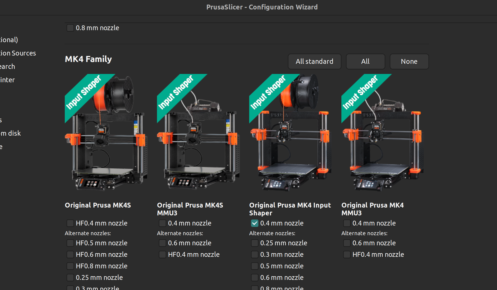
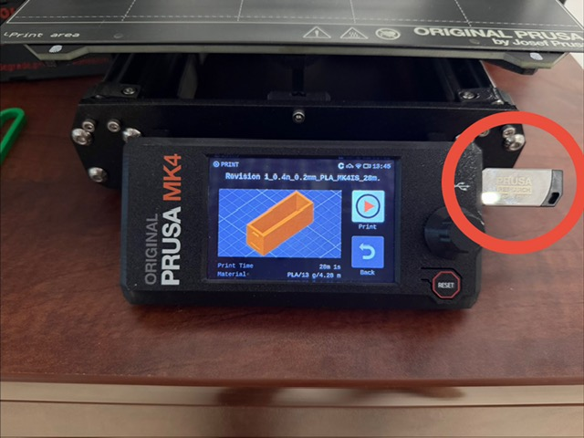

# Original Prusa MK4

# Original Prusa MK4

The Original Prusa MK4 is an open Cartesian (bed-slinger) 3D printer available in the DTC office.

## Getting Started

If you have not used the Prusa MK4 before, or otherwise need help with 3D printing, contact Ryan Kuederle: kuederler1@udayton.edu.

### Preparing Your Print

We recommend using PrusaSlicer: https://www.prusa3d.com/p/prusaslicer/.

- In PrusaSlicer, choose the printer profile named **Original Prusa MK4 Input Shaper** and a 0.4 mm nozzle.
- Select a filament profile that matches the filament loaded in the printer (the "Generic" profiles are usually fine for basic use).
- If you're new to PrusaSlicer, see Prusa's guide: https://help.prusa3d.com/article/first-print-with-prusaslicer_1753?product=prusaslicer

### Starting a Print (USB)

- Make sure the build plate is clean and properly seated. The spring-steel sheet is magnetically attached.
- Align the sheet so the alignment notch sits over the two locating pins at the top of the heatbed.
- Copy your G-code file to a USB drive and insert it into the USB port on the side of the MK4's display.
- Use the control knob (turn to move, press to select) to find your file and press Start.

### After Your Print

- When the print finishes, remove the spring-steel sheet by grasping the corners (avoid touching the print surface with bare hands).
- Gently flex the sheet to release parts; use a plastic scraper for stubborn pieces.
- Do not use metal tools that could gouge the spring steel surface.

### Wireless Printing / Access Requests

The MK4 supports Wi‑Fi printing, but wireless access is restricted. To request permission to print wirelessly, submit this Google Form: [Request Wireless Printing Access](https://docs.google.com/forms/d/e/1FAIpQLSckJDdSpQWUWbNIRqO0h6LokrG6Q7IQ2_-ZudXRN2CUwgkYFw)

- The form is required so we can verify user training and ensure proper filament/setup.
- If approved, you'll receive instructions and the steps needed to upload prints over Wi‑Fi.

## Safety & Best Practices

- Keep long hair, loose clothing, and jewelry away from the printer while it's running.
- The bed and nozzle become very hot—do not touch until they cool.
- Print in a well-ventilated area, especially for filaments like ABS or specialty materials.
- Use the correct print temperature and bed settings for the filament in use.

## Troubleshooting (Common Issues)

- Poor adhesion: make sure the bed sheet is clean and aligned; consider adding a brim or Raft for small footprints.
- First-layer issues: slow down the first layer and verify Z‑offset in PrusaSlicer/profile.
- Stringing: lower print temperature or enable retraction in slicer settings.
- If the printer reports a mechanical or sensor error, do not attempt physical repairs—contact the DTC lead.

## Contact

For assistance or to report issues, email: kuederler1@udayton.edu

---

