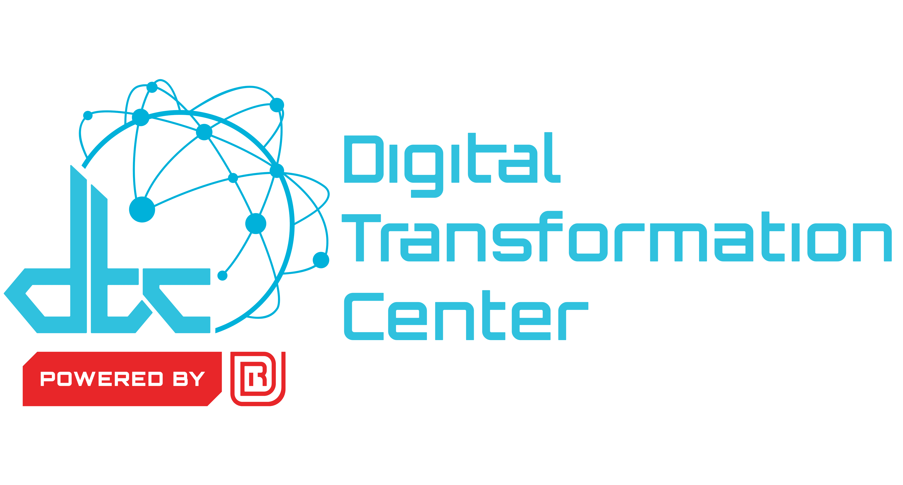

# Universal Robots UR5e

The Universal Robots UR5e is an industrial collaborative robot (cobot) designed to allow human-machine collaboration within industrial automation.

## User Manual

Before working with the UR5e, familiarize yourself with Universal Robot's provided manual:

- [Universal Robots UR5e User Manual (PDF)](https://www.universal-robots.com/manuals/EN/PDF/SW5_19/user-manual-UR5e-PDF_online/710-965-00_UR5e_User_Manual_en_Global.pdf)
- [Universal Robots UR5e User Manual (HTML)](https://www.universal-robots.com/manuals/EN/HTML/SW5_25_1/Content/Landingpages/Web/LandingarmUR5e.htm)

## Training

Before using the UR5e, contact [Ryan Kuederle](kuederler1@udayton.edu) for a brief introductory training session. It is essential that all personnel interacting with the cobot are trained in person.

## Standard Operating Procedure

TODO: write SOP.

